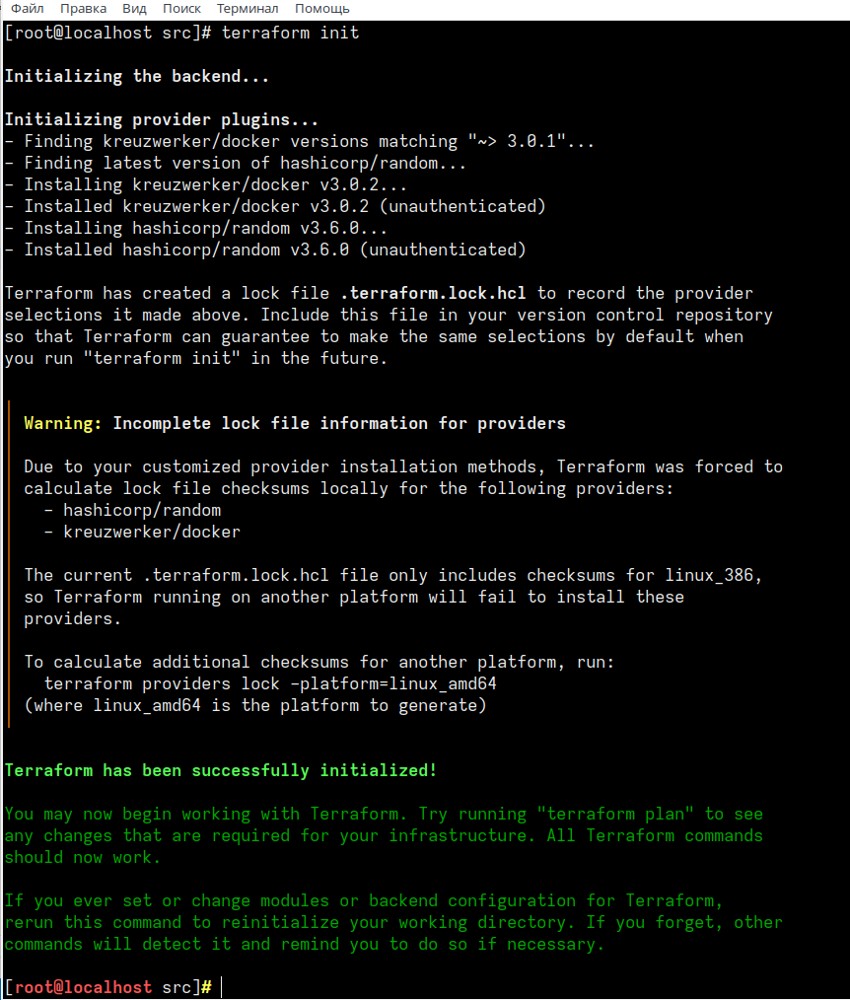
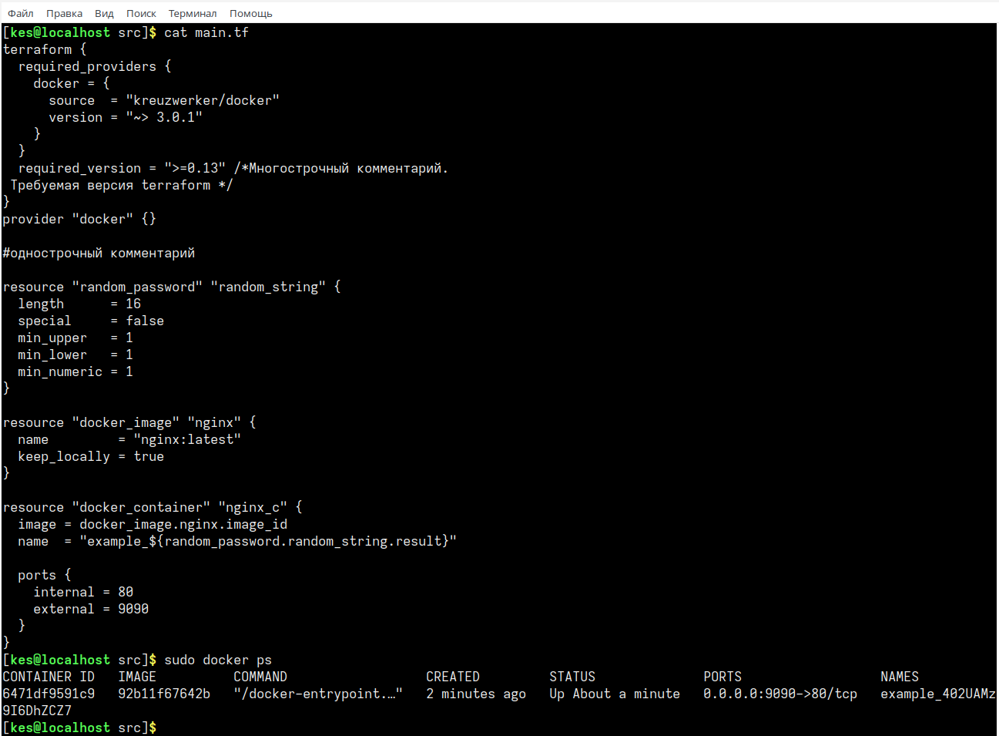

# Домашнее задание к занятию «Введение в Terraform»

### Задание 1

1. Скачайте все необходимые зависимости, использованные в проекте. 


---
2. Изучите файл **.gitignore**. В каком terraform-файле, согласно этому .gitignore, допустимо сохранить личную, секретную информацию?
personal.auto.tfvars

---
3. Выполните код проекта. Найдите  в state-файле секретное содержимое созданного ресурса **random_password**, пришлите в качестве ответа конкретный ключ и его значение.

"result": "402UAMz9I6DhZCZ7"

---
4. Раскомментируйте блок кода, примерно расположенный на строчках 29–42 файла **main.tf**.
Выполните команду ```terraform validate```. Объясните, в чём заключаются намеренно допущенные ошибки. Исправьте их.

- строка 23: в описании ресурса отсутствует "имя" после "типа"
- строка 28: "1nginx" недопустимое имя (не должно начинаться с цифры)
- строка 30: неверная ссылка на random_string и result

---
5. Выполните код. В качестве ответа приложите: исправленный фрагмент кода и вывод команды ```docker ps```


---
6. Ключ --auto-approve применяет изменения без подтверждения. Отдельно данный ключ на продуктивной инфраструктуре применять не рекомендуется, есть вероятность ошибочного удаления ресурсов. Опция полезна в автоматизированных сценариях, где подтверждение невозможно.

---
7. Уничтожьте созданные ресурсы с помощью terraform. Убедитесь, что все ресурсы удалены. Приложите содержимое файла terraform.tfstate.

```
{
  "version": 4,
  "terraform_version": "1.5.0",
  "serial": 29,
  "lineage": "5e527d42-20cd-f890-e131-c47dcbae46da",
  "outputs": {},
  "resources": [],
  "check_results": null
}
```

---
8. Объясните, почему при этом не был удалён docker-образ nginx:latest. Ответ ОБЯЗАТЕЛЬНО НАЙДИТЕ В ПРЕДОСТАВЛЕННОМ КОДЕ, а затем ОБЯЗАТЕЛЬНО ПОДКРЕПИТЕ* строчкой из документации

Для ресурса типа "docker_image" значение **keep_locally** было устанвлено значение **true**

Объяснение из документации:

keep_locally (Boolean) If true, then the Docker image won't be deleted on destroy operation. If this is false, it will delete the image from the docker local storage on destroy operation.
